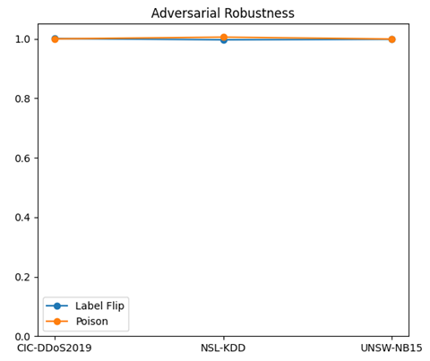
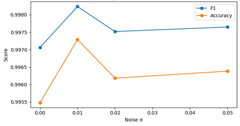
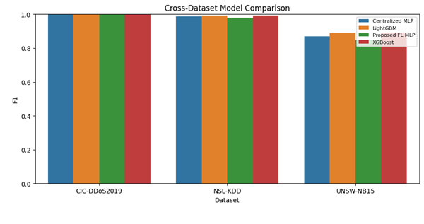
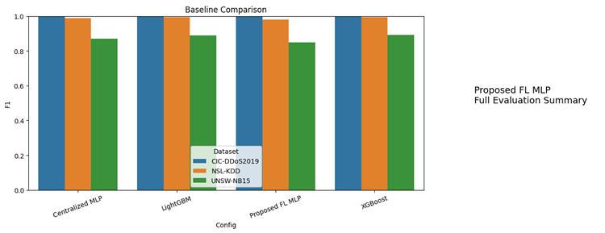

# Privacy-Preserving Federated Learning for Collaborative Intrusion Detection (privacy-preserving-federated-ids)

## Overview
This project implements a privacy-preserving federated learning framework for collaborative intrusion detection using NSL-KDD, UNSW-NB15, and CIC-DDoS2019 datasets.

The framework integrates:
- Differential Privacy (Gaussian noise)
- Byzantine-robust aggregation
- Non-IID data handling (Dirichlet partitioning)
- Context-aware update weighting


## Models
- XGBoost
- LightGBM
- Centralized MLP
- Federated Learning MLP (Proposed)


## Key Features
- Federated learning simulation
- Label flipping and poisoning attacks
- Privacy-utility trade-off analysis
- Statistical tests (Wilcoxon, Friedman)
- Cross-dataset evaluation


## Result

### dataset info

| Dataset      | duplicates_removed | n_train | n_val | n_test | n_features_before_selection | n_features_after_encoding | n_numeric | n_categorical | selector_used | selector_name              | feature_mode | k_best | pca_components |
| ------------ | ------------------ | ------- | ----- | ------ | --------------------------- | ------------------------- | --------- | ------------- | ------------- | -------------------------- | ------------ | ------ | -------------- |
| CIC-DDoS2019 | 222                | 34844   | 4978  | 9956   | 77                          | 77                        | 77        | 0             | True          | selectkbest_mutual_info_77 | selectkbest  | 77     | 48             |
| NSL-KDD      | 5756               | 30970   | 4425  | 8849   | 119                         | 96                        | 38        | 3             | True          | selectkbest_mutual_info_96 | selectkbest  | 96     | 48             |
| UNSW-NB15    | 19173              | 21578   | 3083  | 6166   | 182                         | 96                        | 31        | 3             | True          | selectkbest_mutual_info_96 | selectkbest  | 96     | 48             |


### Final Model Performance

| Dataset      | Config                             | Accuracy  | Precision | Recall    | F1        | ROC-AUC   | PR-AP     | Threshold |
| ------------ | ---------------------------------- | --------- | --------- | --------- | --------- | --------- | --------- | --------- |
| CIC-DDoS2019 | Centralized MLP                    | 0.997389  | 0.999346  | 0.997260  | 0.998302  | 0.999860  | 0.999959  | 0.22      |
| CIC-DDoS2019 | LightGBM                           | 0.998996  | 0.998827  | 0.999870  | 0.999348  | 0.999997  | 0.999999  | 0.10      |
| CIC-DDoS2019 | Proposed FL MLP                    | 0.997489  | 0.998955  | 0.997782  | 0.998368  | 0.999853  | 0.999957  | 0.16      |
| CIC-DDoS2019 | XGBoost                            | 0.999196  | 0.999869  | 0.999087  | 0.999478  | 0.999993  | 0.999998  | 0.41      |
| NSL-KDD      | Centralized MLP                    | 0.988360  | 0.986827  | 0.989749  | 0.988286  | 0.999113  | 0.999163  | 0.57      |
| NSL-KDD      | LightGBM                           | 0.993559  | 0.996562  | 0.990433  | 0.993488  | 0.999836  | 0.999835  | 0.73      |
| NSL-KDD      | Proposed FL MLP                    | 0.979546  | 0.974735  | 0.984282  | 0.979485  | 0.997999  | 0.997975  | 0.73      |
| NSL-KDD      | XGBoost                            | 0.992429  | 0.996326  | 0.988383  | 0.992338  | 0.999798  | 0.999796  | 0.74      |
| UNSW-NB15    | Centralized MLP                    | 0.854038  | 0.773532  | 0.966983  | 0.859507  | 0.949217  | 0.939304  | 0.46      |
| UNSW-NB15    | LightGBM                           | 0.891664  | 0.843366  | 0.939937  | 0.889037  | 0.973810  | 0.969146  | 0.40      |
| UNSW-NB15    | Proposed FL MLP                    | 0.852416  | 0.791981  | 0.922726  | 0.852369  | 0.940951  | 0.928738  | 0.48      |
| UNSW-NB15    | XGBoost                            | 0.896529  | 0.858954  | 0.928346  | 0.892302  | 0.974207  | 0.969675  | 0.45      |
| CIC-DDoS2019 | Proposed FL MLP vs Centralized MLP | 0.000100  | -0.000391 | 0.000522  | 0.000066  | -0.000007 | -0.000002 | NaN       |
| CIC-DDoS2019 | Proposed FL MLP vs LightGBM        | -0.001507 | 0.000128  | -0.002088 | -0.000980 | -0.000144 | -0.000042 | NaN       |
| CIC-DDoS2019 | Proposed FL MLP vs XGBoost         | -0.001708 | -0.000914 | -0.001305 | -0.001110 | -0.000141 | -0.000041 | NaN       |
| NSL-KDD      | Proposed FL MLP vs Centralized MLP | -0.008815 | -0.012092 | -0.005467 | -0.008801 | -0.001115 | -0.001188 | NaN       |
| NSL-KDD      | Proposed FL MLP vs LightGBM        | -0.014013 | -0.021827 | -0.006150 | -0.014003 | -0.001837 | -0.001860 | NaN       |
| NSL-KDD      | Proposed FL MLP vs XGBoost         | -0.012883 | -0.021591 | -0.004100 | -0.012853 | -0.001799 | -0.001821 | NaN       |
| UNSW-NB15    | Proposed FL MLP vs Centralized MLP | -0.001622 | 0.018449  | -0.044257 | -0.007138 | -0.008266 | -0.010566 | NaN       |
| UNSW-NB15    | Proposed FL MLP vs LightGBM        | -0.039247 | -0.051385 | -0.017211 | -0.036668 | -0.032859 | -0.040408 | NaN       |
| UNSW-NB15    | Proposed FL MLP vs XGBoost         | -0.044113 | -0.066973 | -0.005620 | -0.039934 | -0.033256 | -0.040937 | NaN       |


### Privacy-Centric Evaluation

| Dataset      | sigma | Accuracy | F1       | ROC-AUC  | Average_Round_Sigma |
| ------------ | ----- | -------- | -------- | -------- | ------------------- |
| CIC-DDoS2019 | 0.00  | 0.995882 | 0.997324 | 0.999765 | 0.00                |
| CIC-DDoS2019 | 0.01  | 0.996685 | 0.997844 | 0.999835 | 0.01                |
| CIC-DDoS2019 | 0.02  | 0.996886 | 0.997976 | 0.999837 | 0.02                |
| CIC-DDoS2019 | 0.05  | 0.996886 | 0.997975 | 0.999831 | 0.05                |
| NSL-KDD      | 0.00  | 0.980789 | 0.980795 | 0.998286 | 0.00                |
| NSL-KDD      | 0.01  | 0.981467 | 0.981347 | 0.998314 | 0.01                |
| NSL-KDD      | 0.02  | 0.980902 | 0.980811 | 0.998054 | 0.02                |
| NSL-KDD      | 0.05  | 0.971409 | 0.971338 | 0.995579 | 0.05                |
| UNSW-NB15    | 0.00  | 0.773597 | 0.798032 | 0.860273 | 0.00                |
| UNSW-NB15    | 0.01  | 0.848686 | 0.855818 | 0.951519 | 0.01                |
| UNSW-NB15    | 0.02  | 0.850470 | 0.855667 | 0.942934 | 0.02                |
| UNSW-NB15    | 0.05  | 0.849984 | 0.857407 | 0.937176 | 0.05                |


### Ablation Study

| Dataset      | Config                 | Accuracy | F1       | ROC-AUC  | PR-AP    |
| ------------ | ---------------------- | -------- | -------- | -------- | -------- |
| CIC-DDoS2019 | Full                   | 0.996284 | 0.997584 | 0.999770 | 0.999933 |
| CIC-DDoS2019 | IID Instead of Non-IID | 0.997188 | 0.998171 | 0.999893 | 0.999969 |
| CIC-DDoS2019 | No Byzantine Filter    | 0.996083 | 0.997452 | 0.999777 | 0.999935 |
| CIC-DDoS2019 | No Context Weighting   | 0.994576 | 0.996480 | 0.999740 | 0.999923 |
| CIC-DDoS2019 | No Privacy             | 0.996987 | 0.998041 | 0.999847 | 0.999956 |
| NSL-KDD      | Full                   | 0.977399 | 0.977304 | 0.997291 | 0.997283 |
| NSL-KDD      | IID Instead of Non-IID | 0.984744 | 0.984636 | 0.998545 | 0.998544 |
| NSL-KDD      | No Byzantine Filter    | 0.976721 | 0.976505 | 0.997601 | 0.997623 |
| NSL-KDD      | No Context Weighting   | 0.972200 | 0.972128 | 0.997019 | 0.996992 |
| NSL-KDD      | No Privacy             | 0.986665 | 0.986585 | 0.998872 | 0.998896 |
| UNSW-NB15    | Full                   | 0.852741 | 0.856375 | 0.945011 | 0.933933 |
| UNSW-NB15    | IID Instead of Non-IID | 0.855011 | 0.858410 | 0.946753 | 0.936468 |
| UNSW-NB15    | No Byzantine Filter    | 0.844632 | 0.855156 | 0.943686 | 0.933407 |
| UNSW-NB15    | No Context Weighting   | 0.849335 | 0.852423 | 0.943784 | 0.933004 |
| UNSW-NB15    | No Privacy             | 0.854525 | 0.859997 | 0.948381 | 0.938754 |


### ROBUSTNESS (ATTACKS)

| Dataset      | Attack        | Accuracy | F1       | ROC-AUC  |
| ------------ | ------------- | -------- | -------- | -------- |
| CIC-DDoS2019 | label_flip    | 0.996987 | 0.998040 | 0.999822 |
| CIC-DDoS2019 | poison_update | 0.995480 | 0.997063 | 0.999415 |
| NSL-KDD      | label_flip    | 0.973895 | 0.973717 | 0.997096 |
| NSL-KDD      | poison_update | 0.982597 | 0.982436 | 0.998466 |
| UNSW-NB15    | label_flip    | 0.850633 | 0.854571 | 0.945280 |
| UNSW-NB15    | poison_update | 0.849659 | 0.855495 | 0.943413 |


### PRIVACY SUMMARY

| Dataset      | Full_F1  | NoPrivacy_F1 | Utility_Drop_vs_NoPrivacy | NonIID_Penalty_vs_IID | Context_Component_Gain | Byzantine_Filter_Gain | LabelFlip_Retention | Poison_Retention | Sigma0_to_005_Drop |
| ------------ | -------- | ------------ | ------------------------- | --------------------- | ---------------------- | --------------------- | ------------------- | ---------------- | ------------------ |
| CIC-DDoS2019 | 0.997584 | 0.998041     | 0.000457                  | 0.000587              | 0.001104               | 0.000132              | 1.000457            | 0.999478         | -0.000651          |
| NSL-KDD      | 0.977304 | 0.986585     | 0.009281                  | 0.007333              | 0.005176               | 0.000798              | 0.996330            | 1.005252         | 0.009457           |
| UNSW-NB15    | 0.856375 | 0.859997     | 0.003622                  | 0.002035              | 0.003952               | 0.001219              | 0.997894            | 0.998973         | -0.059375          |


### MAIN EXPERIMENTAL RESULTS

| Dataset      | Full_F1  | NoPrivacy_F1 | Utility_Drop_vs_NoPrivacy | NonIID_Penalty_vs_IID | Context_Component_Gain | Byzantine_Filter_Gain | LabelFlip_Retention | Poison_Retention | Sigma0_to_005_Drop | Proposed_FL_F1 | Proposed_FL_ROC_AUC |
| ------------ | -------- | ------------ | ------------------------- | --------------------- | ---------------------- | --------------------- | ------------------- | ---------------- | ------------------ | -------------- | ------------------- |
| CIC-DDoS2019 | 0.997584 | 0.998041     | 0.000457                  | 0.000587              | 0.001104               | 0.000132              | 1.000457            | 0.999478         | -0.000651          | 0.998368       | 0.999853            |
| NSL-KDD      | 0.977304 | 0.986585     | 0.009281                  | 0.007333              | 0.005176               | 0.000798              | 0.996330            | 1.005252         | 0.009457           | 0.979485       | 0.997999            |
| UNSW-NB15    | 0.856375 | 0.859997     | 0.003622                  | 0.002035              | 0.003952               | 0.001219              | 0.997894            | 0.998973         | -0.059375          | 0.852369       | 0.940951            |


### CROSS-VALIDATION

| Dataset      | Model           | CV_F1_mean | CV_F1_std    | CV_ROC_AUC_mean | CV_ROC_AUC_std |
| ------------ | --------------- | ---------- | ------------ | --------------- | -------------- |
| CIC-DDoS2019 | Centralized MLP | 0.998302   | 0.000000e+00 | 0.999860        | 0.000000e+00   |
| CIC-DDoS2019 | LightGBM        | 0.999298   | 2.861976e-04 | 0.999987        | 1.228920e-05   |
| CIC-DDoS2019 | Proposed FL MLP | 0.998368   | 0.000000e+00 | 0.999853        | 1.241267e-16   |
| CIC-DDoS2019 | XGBoost         | 0.999233   | 2.977121e-04 | 0.999965        | 2.561127e-05   |
| NSL-KDD      | Centralized MLP | 0.988286   | 1.241267e-16 | 0.999113        | 1.241267e-16   |
| NSL-KDD      | LightGBM        | 0.994180   | 3.093843e-04 | 0.999734        | 7.226087e-05   |
| NSL-KDD      | Proposed FL MLP | 0.979485   | 1.241267e-16 | 0.997999        | 0.000000e+00   |
| NSL-KDD      | XGBoost         | 0.993820   | 4.498270e-04 | 0.999722        | 7.831755e-05   |
| UNSW-NB15    | Centralized MLP | 0.859507   | 0.000000e+00 | 0.949217        | 1.241267e-16   |
| UNSW-NB15    | LightGBM        | 0.895475   | 2.976113e-03 | 0.974115        | 1.284475e-03   |
| UNSW-NB15    | Proposed FL MLP | 0.852369   | 0.000000e+00 | 0.940951        | 0.000000e+00   |
| UNSW-NB15    | XGBoost         | 0.895043   | 3.057490e-03 | 0.973957        | 1.361588e-03   |


### OVERHEAD SUMMARY

| Dataset      | Train Time (s) | Rounds | Best Threshold | Best Val F1 |
| ------------ | -------------- | ------ | -------------- | ----------- |
| CIC-DDoS2019 | 63.891971      | 24     | 0.16           | 0.998825    |
| NSL-KDD      | 60.381413      | 24     | 0.73           | 0.983405    |
| UNSW-NB15    | 44.478718      | 24     | 0.48           | 0.859541    |

### Statistical Testing
## WILCOXON TEST

| Dataset      | Comparison                         | Wilcoxon_stat | p_value | Significant_at_0.05 |
| ------------ | ---------------------------------- | ------------- | ------- | ------------------- |
| CIC-DDoS2019 | XGBoost vs LightGBM                | 1.0           | 0.2500  | False               |
| CIC-DDoS2019 | Proposed FL MLP vs XGBoost         | 0.0           | 0.0625  | False               |
| CIC-DDoS2019 | Proposed FL MLP vs LightGBM        | 0.0           | 0.0625  | False               |
| CIC-DDoS2019 | Proposed FL MLP vs Centralized MLP | NaN           | 1.0000  | False               |
| NSL-KDD      | XGBoost vs LightGBM                | 2.0           | 0.1875  | False               |
| NSL-KDD      | Proposed FL MLP vs XGBoost         | 0.0           | 0.0625  | False               |
| NSL-KDD      | Proposed FL MLP vs LightGBM        | 0.0           | 0.0625  | False               |
| NSL-KDD      | Proposed FL MLP vs Centralized MLP | 0.0           | 0.0625  | False               |
| UNSW-NB15    | XGBoost vs LightGBM                | 7.0           | 1.0000  | False               |
| UNSW-NB15    | Proposed FL MLP vs XGBoost         | 0.0           | 0.0625  | False               |
| UNSW-NB15    | Proposed FL MLP vs LightGBM        | 0.0           | 0.0625  | False               |
| UNSW-NB15    | Proposed FL MLP vs Centralized MLP | NaN           | 1.0000  | False               |


## FRIEDMAN TEST

| Friedman_statistic | p_value  | AvgRank_XGBoost | AvgRank_LightGBM | AvgRank_Centralized MLP | AvgRank_Proposed FL MLP |
| ------------------ | -------- | --------------- | ---------------- | ----------------------- | ----------------------- |
| 7.4                | 0.060184 | 1.333333        | 1.666667         | 3.333333                | 3.666667                |


### Key Contributions
- Unified FL framework integrating Differential Privacy, Byzantine-resilient aggregation, and context-aware weighting for privacy, robustness, and non-IID handling.
- Comprehensive privacy–utility trade-off analysis with stable performance across noise levels (σ = 0.00–0.05).
- Strong robustness against adversarial attacks (label-flip and poisoning) with near-lossless performance.
- Statistically validated results using Wilcoxon and Friedman tests, confirming reliability and consistency.
- Proven cross-dataset generalization on CIC-DDoS2019, NSL-KDD, and UNSW-NB15.
- Lightweight MLP-based FL model enabling fast convergence and low computational cost.

### Methodology

Federated learning architecture where clients train locally and share model updates with a central server.
- Model: Lightweight MLP
- Privacy: Differential Privacy (Gaussian noise)
- Robustness: Byzantine-resilient aggregation
- Heterogeneity: Context-aware weighting for non-IID data
- Evaluation: CIC-DDoS2019, NSL-KDD, UNSW-NB15 with accuracy, F1-score, robustness, and - statistical tests

## Figures

### Utility Drop (Privacy Enabled)


### Non-IID Penalty


### Adversarial Robustness


### Privacy–Utility Trade-off CIC-DDoS2019


### Privacy–Utility Trade-off NSL-KDD


### Privacy–Utility Trade-off UNSW-NB15


### Unified Privacy–Utility Trade-off Across Datasets


### Cross-Dataset F1 Heatmap


### Cross-Dataset Model Comparison


### Baseline Comparison


## Dataset

- NSL-KDD (Network Intrusion Detection dataset)
- UNSW-NB15 (Modern network traffic dataset)
- CIC-DDoS2019 (DDoS attack dataset)

## DOI
DOI: https://doi.org/10.5281/zenodo.19998858


## Reproducibility

```bash
git clone https://github.com/your-repo/privacy-preserving-federated-ids.git
cd privacy-preserving-federated-ids
pip install -r requirements.txt
python src/train.py
python src/evaluate.py

## Project Structure

- notebooks/ : Jupyter notebooks
- src/ : source code
- results/ : output files
- external_ids_datasets/ : local datasets (not included in GitHub)

## Dataset Note

Datasets are stored locally in `external_ids_datasets/`.  
They will be loaded automatically when running the notebook.


